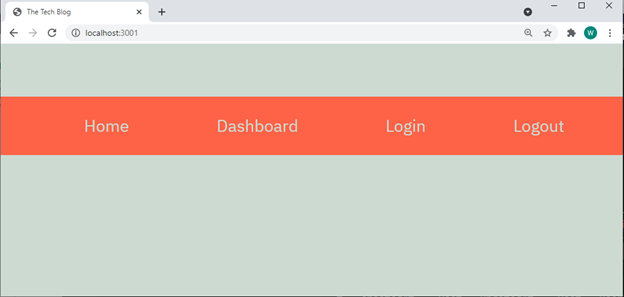
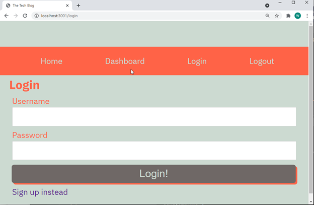
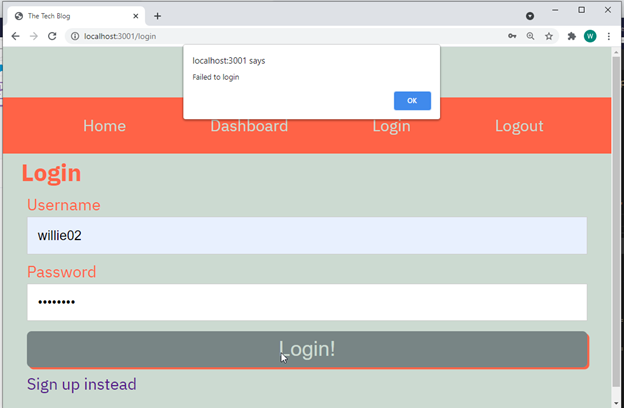
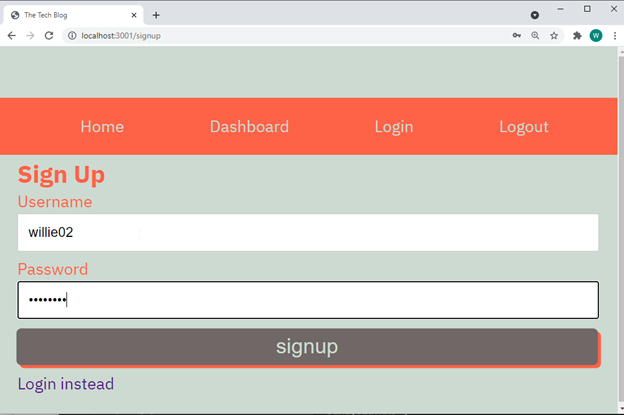
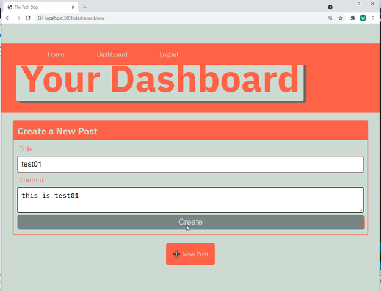
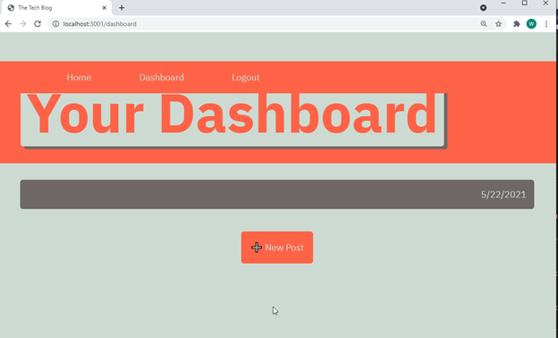
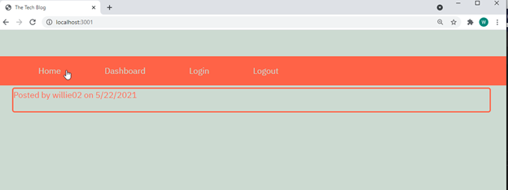

## 14 Model-View-Controller (MVC): Tech Blog

## License 
    This application is covered under the MIT license.

## Tech Blog

## Table of Contents
  [Title](#title)  
  [Description](#description)  
  [Installation](#installation)  
  [Usage](#usage)  
  [Appearance](#appearance)  
  [License](#license)  
  [Contribution](#contribution)  
  [Test](#test)  
  [Links](#links)  
  [Questions](#questions)

  ## Description

Writing about tech can be just as important as making it. Developers spend plenty of time creating new applications and debugging existing codebases, but most developers also spend at least some of their time reading and writing about technical concepts, recent advancements, and new technologies.

This is a CMS-style blog site similar to a Wordpress site, where developers can publish their blog posts and comment on other developers’ posts as well. This application is deployed to Heroku. It follows the MVC paradigm in its architectural structure, using Handlebars.js as the templating language, Sequelize as the ORM, and the express-session npm package for authentication.

A link to a walkthrough video that demonstrates its functionality is provided below. 

  ## Installation
  npm i
  
  ## Usage
 To serve as a tech-blog for technologists to post and comment about technology.

  ## Appearance

  ## License
    Copyright [2021] [Willie Libet]
    
    THE SOFTWARE IS PROVIDED "AS IS", WITHOUT WARRANTY OF ANY KIND, 
    EXPRESS OR IMPLIED, INCLUDING BUT NOT LIMITED TO THE WARRANTIES OF MERCHANTABILITY, 
    FITNESS FOR A PARTICULAR PURPOSE AND NONINFRINGEMENT. IN NO EVENT SHALL THE 
    AUTHORS OR COPYRIGHT HOLDERS BE LIABLE FOR ANY CLAIM, DAMAGES OR OTHER LIABILITY, 
    WHETHER IN AN ACTION OF CONTRACT, TORT OR OTHERWISE, ARISING FROM, OUT OF OR IN 
    CONNECTION WITH THE SOFTWARE OR THE USE OR OTHER DEALINGS IN THE SOFTWARE.

  ## Contribution
  Willie 

  ## Test
  Run: node server.js

  ## Links

[Click here to go to github repository.](https://github.com/willielibet/tech-blog.git)

[Click here to go to deployed application.](https://willie-tech-blog.herokuapp.com/)

  ## Questions 
  [willielibet's GitHub](https://github.com/willielibet)   
  Reach me with additional questions at write2technology@gmail.com.
